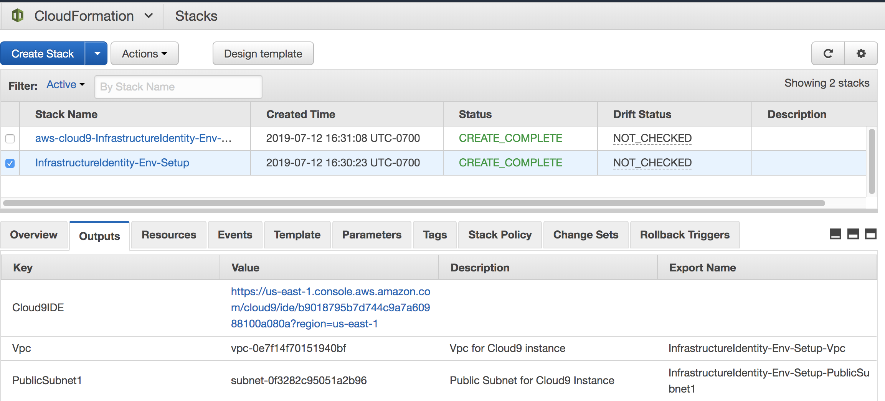

# Module 1: Environment build and configuration

In the first module you will set up a VPC with a Cloud9 IDE for your use.  You'll be running one CloudFormation template which will automate the creation of the environment and then you will manually configure the rest.

## Deploy the AWS CloudFormation template

To initiate the scenario and configure your environment you will need to run the module 1 CloudFormation template:

!!! info "Before you deploy the CloudFormation template feel free to view it <a href="https://github.com/meggers0/Infrastructure-Identity-Workshop/blob/PR-000/templates/01-environment-setup.yaml" target="_blank">here</a href>."

Region| Deploy
------|-----
US East 1 (N.Virginia) | 

1. Click the **Deploy to AWS** button above.  This will automatically take you to the console to run the template. Scroll down and select **Next**.

2. On the **Specify Details** section enter the necessary parameters as shown below.

	| Parameter | Value  |
	|---|---|
	| Stack name | InfrastructureIdenity-Env-Setup  |

3. Once you have entered your parameters click **Next**, then click **Create** \(leave everything on this page at the default\).

This will bring you back to the CloudFormation console. You can refresh the page to see the stack starting to create. Before moving on, make sure the stack is in a **CREATE_COMPLETE** status as shown below.

The CloudFormation template you just ran created a VPC and a Cloud9IDE.

## Architecture Overview

Your environment is now configured and ready for next steps.  Below is a diagram to depict the initial environment.

After you have successfully setup your environment, you can proceed to the next module.
