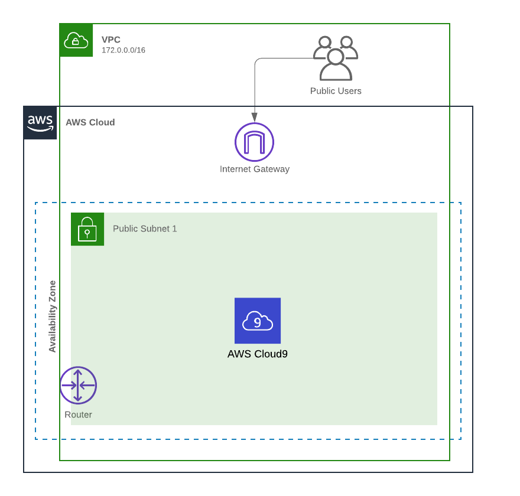

# Module 1: Setup Instructions

In the first module you will set up a VPC with a Cloud9 IDE for your use.  You'll be running one CloudFormation template which will automate the creation of the environment and then you will manually configure the rest. AWS Cloud9 is a cloud-based integrated development environment (IDE) that lets you write, run, and debug your code with just a browser. It includes a code editor, debugger, and terminal. Cloud9 comes pre-packaged with essential tools for popular programming languages and the AWS Command Line Interface (CLI) pre-installed so you don’t need to install files or configure your laptop for this workshop.

To setup your environment please expand one of the following drop-downs (depending on how if you are doing this workshop at an **AWS event** or **individually**) and follow the instructions:

??? info "Click here if you are *using your own AWS account*. You will be using your computer to run the commands."

	Log in to your account however you would normally. You should use an IAM user or role with admin rights.

	**CloudFormation:** Launch the CloudFormation stack below to setup the environment:

	Region| Deploy
	------|-----
		US East 1 (Virginia) | 

	1. Click the **Deploy to AWS** button above.  This will automatically take you to the console to run the template.  
	2. Click **Next** under the **Create stack** section.
	3. Click **Next** under the **Specify stack details** section (the stack name will already be filled - you can leave the other options in Parameters at their default settings too)
	4. Click **Next** under the **Advanced options** section.
	5. Finally, acknowledge that the template will create IAM resources with custom names under **Capabilities** and click **Create stack**.

	This will bring you back to the CloudFormation console. You can refresh the stack set to see the latest status. Before moving on, make sure the stack finally shows **CREATE_COMPLETE**.

	You will need to configure the <a href="https://aws.amazon.com/cli/" target="_blank"> AWS CLI </a> on your computer with an access key from a principal (IAM user, role, etc) that has at least IAM Full Access and sts:AssumeRole (in order to complete the cleanup at the end, you will also need Lambda Full Access and CloudFormation Full Access.) Then move on to **Task 1**.

??? info  "Click here if you're at an *AWS event* where the *Event Engine* is being used. You will be using Cloud9 to run the commands."

    

      **Step 1** : Retrieve temporary credentials from Event Engine
    

	1. Navigate to the <a href="https://dashboard.eventengine.run" target="_blank">Event Engine dashboard</a>
	2. Enter your **team hash** code.
	3. Click **AWS Console**
	4. Copy the **export** commands under the **Credentials** section for the temporary credentials (you will need these in the next step.)

    

      **Step 2** : Connect to the AWS Console via Event Engine and browse to the AWS Cloud9 IDE
    

	1. Click **Open Console** from the Event Engine window
	2. Navigate to the <a href="https://us-east-1.console.aws.amazon.com/cloud9/home" target="_blank">AWS Cloud9</a> console.
	2. Click on **Open IDE** in the `workshop-environment` under **Your environments**
	3. Click the **gear image** icon in the upper right hand corner to open the Cloud9 Preferences. Scroll down in the settings, click on the **AWS SETTINGS** section and click the button next to **AWS managed temporary credentials** to disable this.
	5. Now go to a Cloud9 terminal tab (tab title will start with the words **bash**).
	6. Type `aws configure --profile default` hit enter. Hit enter until you get to the choice **Default region name** and type in `us-east-1`. Hit enter and then enter again to leave this menu.
	7. Then create a file in the `~/.aws` directory named `credentials` and paste in the credentials you copied from the Event Engine. You will need to remove the word **export** from the start of each line. Add `[default]` before all these rows. You should end up with something that looks like this: 
	[default] 
	AWS_ACCESS_KEY_ID=ASIA________ 
	AWS_SECRET_ACCESS_KEY=iZoD_______________________ 
	AWS_SESSION_TOKEN=FQoG_____________________________________________ 
	8. Now you can run commands from within the Cloud9 IDE using the temporary credentials from Event Engine. If you open a new tab you will need to paste in the credentials again.
	9. Move on to **Task 1**.

<!---
??? info  "Click here if you're at an *AWS event* and *AWS provided an account to you*. You will be using Cloud9 to run the commands."

	

      **Step 1**: Login to the console and run the CloudFormation template
    

	**Console Login:** Your team should have been given a piece of paper with a URL and credentials. This will allow you to login using AWS SSO.

	After you login click **AWS Account** box, then click on the Account ID displayed below that (the red box in the image.) You should see a link below that for **Management console**. Click on that and you will be taken the AWS console. Make sure the region is set to US East 2 (Ohio).

	** Click the *Deploy to AWS* button below to launch the CloudFormation stack. **

	Region| Deploy
	------|-----
	US East 1 (Virginia) | 

	1. Click **Next** on the **Select Template** section.
	2. Click **Next** on the **Specify Details** section (the stack name will be already filled - you can change it or leave it as is)
	3. Click **Next** on the **Options** section.
	4. Finally, acknowledge that the template will create IAM roles under **Capabilities** and click **Create**.
	5. This will bring you back to the CloudFormation console. You can refresh the page to see the stack starting to create. Before moving on, make sure the stack shows **CREATE_COMPLETE**.

	 

      **Step 2** : Create an IAM user so you can grab the
    

    

      **Step 2** : Connect to the AWS Cloud9 IDE
    

	1. Navigate to the <a href="https://us-east-2.console.aws.amazon.com/cloud9/home" target="_blank">AWS Cloud9</a> console.
	2. Click on **Open IDE** in the `workshop-environment` under **Your environments**
	3. Click the **gear** icon in the upper right hand corner to open the Cloud9 Preferences. Scroll down in the settings, click on the **AWS SETTINGS** section and click the button next to **AWS Managed Temporary Credentials** to disable this.
	4. --- Need steps here ---
	4. Go back to the Cloud9 environment. Type `aws configure` hit enter. Hit enter until you get to the choice **Default region name** and type in `us-east-2`. Hit enter and then enter again to leave this menu.
	5. Then create a file in the `~/.aws` directory named `credentials` and paste in the credentials you copied from the SSO login page. Rename the profile to `default` (it will be named something similar to **Account_ID_AdministratorAccess** when you first paste it in)
	4. Now you can run commands from within the Cloud9 IDE using the temporary credentials from AWS SSO.
	4. Move on to **Task 1**.
--->

---

###

## Architecture Overview

Your environment is now configured and ready for next steps.  Below is a diagram to depict the initial environment.

After you have successfully setup your environment, you can proceed to the next module.
