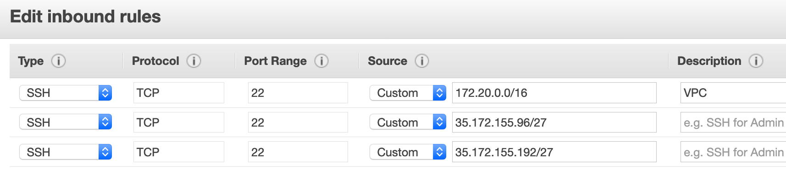

# Module 2: Session Manager ~ 30 minutes

We were given the task to setup secure administrative access to our instances but we know that anytime someone logs into a system changes can be made and those changes could inadvertently affect the security of the host. Instead of hoping our system security doesn't change, let's ensure all changes introduced into production are treated like a code release which go through our standard deployment pipeline, this pipeline includes appropriate security and configuration checks as well as code reviews. Given this change to our process we will restrict all access into production systems. This approach to administrative access is called *Immutable Infrastructure*, which includes managing services and software deployments on IT resources wherein components are replaced rather than changed. An application or service is effectively redeployed each time changes are required. Given this is a new access pattern for our team, we will continue to allow access to our development systems. Using Amazon Systems Manager Session Manager and AWS IAM with tag based permissions we will implement this exact scenario and review the audit logs.

In this Module we will create IAM roles with permissions to enable Session Manager access. Additionally, we are going to deploy 4 systems:

 * AWS EC2 Instance tagged with development
 * AWS EC2 Instance tagged with production
 * Mock on-premises system tagged with development
 * Mock on-premises system tagged with production

Please note our mock on-premises systems will be EC2 instances, however we will treat them like on-premises systems by not assigning an Instance Profile.

!!! Terminology
    A *managed instance* is any machine configured for AWS Systems Manager. You can configure Amazon EC2 instances or on-premisess machines in a hybrid environment as a *managed instance*. Systems Manager supports various distributions of Linux, including Raspberry Pi devices, and Microsoft Windows Server. In the AWS Management Console, any machine prefixed with "mi-" is an on-premisess server or virtual machine (VM) *managed instance*. AWS Systems Manager offers a standard-instances tier and an advanced-instances tier for servers and VMs in your hybrid environment. Advanced instances also enable you to connect to your hybrid machines by using AWS Systems Manager Session Manager. Session Manager provides interactive shell access to your instances. While this lab focuses on Session Manager which is a capability of AWS Systems Manager there are several other capabilities of AWS Systems Manager that you can take advantage of, more information about <a href="https://docs.aws.amazon.com/systems-manager/latest/userguide/features.html" target="_blank">System Manager Capabilities</a>

## Tasks

1. Create IAM roles and permissions to enable Session Manager
2. Setup AWS Systems Manager to manage systems on-premises
3. Create instances and install the SSM Agent
4. Configure Systems Manager and enable management of on-premises systems
5. Create IAM users and policy restrictions based on tags
6. Configure logging
7. Confirm appropriate access and review logs

### Task 1: Create IAM roles and permissions to enable Session Manager for Amazon EC2 Instances

1.Return to the <a href="https://us-east-1.console.aws.amazon.com/cloud9/home" target="_blank">AWS Cloud9</a> console and use the tab that you opened in   Module 1.

2.Create an instance profile:

```bash
aws iam create-instance-profile --instance-profile-name SSMLabProfile
```

3.Create the json trust policy doc to attach to the IAM role. Create a new file with the following contents, save the file name: **lab-role-trust-policy.json**:
```json
{
  "Version": "2012-10-17",
  "Statement": {
    "Effect": "Allow",
    "Principal": {"Service": "ec2.amazonaws.com"},
    "Action": "sts:AssumeRole"
  }
}
```

4.Create an IAM role using the trust policy above:
```bash
aws iam create-role --role-name SSMLabRole --assume-role-policy-document file://lab-role-trust-policy.json
```

5.Add the role to the instance profile:
```bash
aws iam add-role-to-instance-profile --role-name SSMLabRole --instance-profile-name SSMLabProfile
```

6.Attach the existing **EC2RoleSSMAccess** to the newly created instance-profile:
```bash
aws iam attach-role-policy --policy-arn arn:aws:iam::aws:policy/service-role/AmazonEC2RoleforSSM --role-name SSMLabRole
```

7.Create the json trust policy doc to attach to the IAM role. Create a new file with the following contents, save the file name: **ssmservice-trust-policy.json**
```json
{
  "Version": "2012-10-17",
  "Statement": {
    "Effect": "Allow",
    "Principal": {"Service": "ssm.amazonaws.com"},
    "Action": "sts:AssumeRole"
  }
}
```

8.Create a new role named **SSMServiceRole** and attach the trust policy you created in the previous step:
```bash
aws iam create-role --role-name SSMServiceRole --assume-role-policy-document file://ssmservice-trust-policy.json
```

9.As a starting point, we will use AmazonSSMManagedInstanceCore to grant permission for Systems Manager to interact with your instances. AmazonSSMManagedInstanceCore, enables an instance to use AWS Systems Manager service core functionality. Depending on your operations plan, you might need permissions represented in one or more of the other three policies. To view this policy in the console go to services, IAM, Access Management, Policies and search for the **AmazonSSMManagedInstanceCore** policy, click on the policy, view the permissions by clicking on the permissions tab. Now attach this policy to the role using attach-role-policy command.

```bash
aws iam attach-role-policy --role-name SSMServiceRole --policy-arn arn:aws:iam::aws:policy/AmazonSSMManagedInstanceCore
```

10.Let's make sure we allow our on-premises systems to write to CloudWatchLogs so that we can use the same Audit and Logging tools to review administrative access. We'll use the same Attach-role-policy to attach a policy that enables the SSMServiceRole to write to CloudWatchLogs.
```bash
aws iam attach-role-policy --role-name SSMServiceRole --policy-arn arn:aws:iam::aws:policy/CloudWatchAgentServerPolicy
```

11.Let's confirm all the correct policies are attached to our role. Run the following command.
```bash
aws iam list-attached-role-policies --role-name SSMServiceRole
```
The result should return the following:
````
{
    "AttachedPolicies": [
        {
            "PolicyName": "CloudWatchAgentServerPolicy",
            "PolicyArn": "arn:aws:iam::aws:policy/CloudWatchAgentServerPolicy"
        },
        {
            "PolicyName": "AmazonSSMManagedInstanceCore",
            "PolicyArn": "arn:aws:iam::aws:policy/AmazonSSMManagedInstanceCore"
        }
    ]
}
````
12.Let's also confirm the trust policy is correct. We want to confirm that for the Principal in the AssumeRolePolicyDocument is **"Service":"ssm.amazonaws.com"**, which allows the AWS Systems Manager Service the permissions granted in the policies we attached and listed in the previous steps. Run the following command:
```bash
aws iam get-role --role-name SSMServiceRole
```
The result should return the following:
````
{
    "Role": {
        "AssumeRolePolicyDocument": {
            "Version": "2012-10-17",
            "Statement": [
                {
                    "Action": "sts:AssumeRole",
                    "Effect": "Allow",
                    "Principal": {
                        "Service": "ssm.amazonaws.com"
                    }
                }
            ]
        },
        "MaxSessionDuration": 3600,
        "RoleId": "AROATXJRVGL4QLCVNGI77",
        "CreateDate": "2020-03-03T14:59:37Z",
        "RoleName": "SSMServiceRole",
        "Path": "/",
        "RoleLastUsed": {},
        "Arn": "arn:aws:iam::256191574777:role/SSMServiceRole"
    }
}
````

### Task 2: Setup AWS Systems Manager to manage systems on-premises

The activation process provides an Activation Code and ID which functions like an access key ID and secret key to provide secure access to the Systems Manager service from your *managed instances*.

!!! Attention
    If you've been using the Cloud9IDE in this lab please continue to run these commands from there.

1.In your Cloud9IDE, using the same tab, create a managed-instance activation for your Dev instance, copy the "activation-code" and "activation-id" and label it as **DevOnPrem** in your scratch pad, we will use it later.
``` bash
aws ssm create-activation --default-instance-name DevOnPrem --iam-role SSMServiceRole --registration-limit 10 --region us-east-1
```

2.Create a managed-instance activation for your Prod instance, copy the "activation-code" and "activation-id" and label it as **ProdOnPrem** in your scratch pad, we will use it later.
``` bash
aws ssm create-activation --default-instance-name ProdOnPrem --iam-role SSMServiceRole --registration-limit 10 --region us-east-1
```

**Store the managed-instance Activation Code and Activation ID in a safe place.** You specify this Code and ID when you install SSM Agent on systems on-premises. The code and ID combination functions like an Amazon EC2 access key ID and secret key to provide secure access to the Systems Manager service from your *managed instances*.

>If you lose the Code and ID, you must create a new activation. An activation expiration is a window of time when you can register on-premises machines with Systems Manager, default is 24 hours. An expired activation has no impact on your servers or virtual machines (VMs) that you registered with Systems Manager. This means that if an activation expires then you can’t register more servers or VMs with Systems Manager by using that specific activation code. You simply need to create a new one. All of the servers and VMs that you registered will continue to be registered Systems Manager *managed instances* until you remove or disable SSM Agent on the server or VM and thereby unregister it. <a href="https://docs.aws.amazon.com/cli/latest/reference/ssm/create-activation.html" target="_blank">For more details:</a>

### Task 3: Create instances and install the SSM Agent

Please note that in order to create a mock on-premises system we need to create and use key-pair for initial access to install the Systems Manager agent. We do not need a key pair for the AWS EC2 instances because we are using Session Manager to gain direct access.

!!! Attention
    If you are using Cloud9, please perform the following on the Cloud9 instance.

1.Create a key pair for SSH access to the on-premises systems. Choose a key name that you can remember, and replace MyKeyPair with that name.
```bash
aws ec2 create-key-pair --key-name MyKeyPair --query 'KeyMaterial' --output text > MyKeyPair.pem
```
2.Update the permissions on the private key file so that only you can read it.
```bash
chmod 400 MyKeyPair.pem
```

3.Copy the name of your key pair to your scratch pad.

!!! info
    What is a Key Pair?

    Amazon EC2 uses public key cryptography to encrypt and decrypt login information. Public key cryptography uses a public key to encrypt a piece of data, and then the recipient uses the private key to decrypt the data. The public and private keys are known as a key pair. Public key cryptography enables you to securely access your instances using a private key instead of a password.

    When you launch an instance, you specify the key pair. You can specify an existing key pair or a new key pair that you create at launch. At boot time, the public key content is placed on the instance in an entry within ~/.ssh/authorized_keys. To log in to your instance, you must specify the private key when you connect to the instance.

4.Go back to the CloudFormation Stack, copy the following to your scratchpad:

 * Find the stack that starts with "aws-cloud9-" click on **Resources**, copy the ID next to the **InstanceSecurityGroup**
 * Find the stack named "InfrastructureIdentity-Env-Setup", click on **Resources**, copy the ID next to **PublicSubnet1** to the same scratch pad


!!! Tip
    At this point, make sure you have captured 3 items on your scratch pad:
    > 1. SECGROUP - the security group ID of the InstanceSecurityGroup
    > 2. SUBNET - the subnet ID of PublicSubnet1
    > 3. MYKEYPAIR - the name of the key pair you created.

5.Let's use a script to build our systems. Create a file called CreateSystems.sh. Copy the items from your scratch pad and replace them in the file you just created.
```json
#!/bin/bash

## update with your subnet
SUBNET="subnet-xxxx"
## update with your security group
SECGROUP="sg-xxxx"
## update with your own key
MYKEYPAIR="MyKeyPairxxxx"
##update with your region
REGION="us-east-1"

#---no need to modify below----
## Create the Production Ec2Instance
aws ec2 run-instances --iam-instance-profile Name=SSMLabProfile --image-id ami-0080e4c5bc078760e --instance-type t1.micro --subnet-id "${SUBNET}" --security-group-ids "${SECGROUP}" --associate-public-ip-address --tag-specifications 'ResourceType=instance,Tags=[{Key="Name",Value="ProdEC2Instance"},{Key="Environment",Value="Prod"}]' --region "${REGION}"

## Create the Development Ec2Instance
aws ec2 run-instances --iam-instance-profile Name=SSMLabProfile --image-id ami-0080e4c5bc078760e --instance-type t1.micro --subnet-id "${SUBNET}" --security-group-ids "${SECGROUP}" --associate-public-ip-address --tag-specifications 'ResourceType=instance,Tags=[{Key="Name",Value="DevEC2Instance"},{Key="Environment",Value="Dev"}]' --region "${REGION}"

## Create the Production on-premises system
aws ec2 run-instances --image-id ami-0080e4c5bc078760e --instance-type t1.micro --subnet-id "${SUBNET}" --security-group-ids "${SECGROUP}" --associate-public-ip-address --key-name "${MYKEYPAIR}" --tag-specifications 'ResourceType=instance,Tags=[{Key="Name",Value="ProdOnPrem"},{Key="Environment",Value="Prod"}]' --region "${REGION}"

## Create the Development on-premises system
aws ec2 run-instances --image-id ami-0080e4c5bc078760e --instance-type t1.micro --subnet-id "${SUBNET}" --security-group-ids "${SECGROUP}" --associate-public-ip-address --key-name "${MYKEYPAIR}" --tag-specifications 'ResourceType=instance,Tags=[{Key="Name",Value="DevOnPrem"},{Key="Environment",Value="Dev"}]' --region "${REGION}"
```
6.Change the permissions on your scripts so that only you as the owner can execute it.
```bash
chmod 0755 CreateSystems.sh
```
7.Execute the script.
```bash
./CreateSystems.sh
```
8.Let's confirm that we have 4 new systems running. Go to <a href="https://console.aws.amazon.com/ec2/v2/home?region=us-east-1#Home:" target="_blank">EC2 Console</a>
Click on **Running Systems** you will see a list of systems. Click on each of the new systems. Notice that ProdEC2Instance and DevEC2Instance do not have Key pair names associated as we built them without a key pair and will be using Session Manager to access them. We will use the key pair only for the OnPrem systems as we need to install the SSM Agent.

 * ProdEC2Instance
 * DevEC2Instance
 * ProdOnPrem
 * DevOnPrem

9.For each instance find the **private IPv4 address** and copy it to your scratchpad. To find the private IPv4 address from the Amazon EC2 console check the box next to the instance, a menu with details including the Private IPs will show on the bottom of the screen, copy the Private IP address associated to that instance to your scratchpad. Do this for all 4 new systems.

Your scratchpad should be similar to the following:
> * ProdEC2Instance 172.20.1.x
> * DevEC2Instance 172.20.1.x
 * ProdOnPrem 172.20.1.x
 * DevOnPrem 172.20.1.x

10.Update the inbound rules for the Cloud9 Security Group to only allow SSH from the VPC Subnet **172.20.0.0/16.** From the <a href="https://console.aws.amazon.com/ec2/v2/home?region=us-east-1#Home:" target="_blank">EC2 Console</a> scroll down to **NETWORK & SECURITY**, click on **Security Groups**, click the box next to the Security Group that starts with **"aws-cloud9-mod-"**, go to the **inbound tab** and click edit. Click **Add Rule**, Under Type select **SSH**, for the Source use **172.20.0.0/16** and add "VPC" in the description.

The updated inbound rules for the Security Group should look like this:


??? info "The public address ranges already in the Security Group are the public addresses for the Cloud9 Service for the us-east-1 region, for more <a href="https://docs.aws.amazon.com/cloud9/latest/user-guide/ip-ranges.html" target="_blank">information</a>."

11.From your Cloud9 instance ssh to the DevOnPrem instance. You specify the path and file name of the private key (.pem), the user name for your AMI, and the private ip address for the instance.

>Note: Replace MyKeyPair.pem with the name of the key-pair you created, this should be in your scratch pad. And replace 172.20.x.x with the Private IP associated with the DevOnPrem instance.
```bash
ssh -i MyKeyPair.pem ec2-user@172.20.x.x
```

12.Then run the following commands to install SSM.
> Note: Replace "activation-code" and "activation-id" for the DevOnPrem instance with the code and id on your scratch pad.
```bash
sudo yum update -Y
mkdir /tmp/ssm
curl https://s3.amazonaws.com/ec2-downloads-windows/SSMAgent/latest/linux_amd64/amazon-ssm-agent.rpm -o /tmp/ssm/amazon-ssm-agent.rpm
sudo yum install -y /tmp/ssm/amazon-ssm-agent.rpm
sudo stop amazon-ssm-agent
sudo amazon-ssm-agent -register -code "activation-code" -id "activation-id" -region us-east-1
sudo start amazon-ssm-agent
```

13.From your Cloud9 instance use the ssh command to connect to ProdOnPrem instance. You specify the path and file name of the private key (.pem), the user name for your AMI, and the private ip address for the instance. Additionally, you will need the private IPv4 address for your instance using the Amazon EC2 console. From the Amazon EC2 console check the box next to the ProdOnPrem instance, a menu with details including the Private IPs will show on the bottom of the screen, copy the Private IP address associated to your OnPrem instance and use it below.


>Note: Replace my-key-pair.pem with the name of the key-pair you created, this should be in your scratch pad. And replace 172.16.x.x with the Private IP associated with the ProdOnPrem instance.
```bash
ssh -i /path/my-key-pair.pem ec2-user@172.16.x.x
```

11. Then run the following commands to install SSM.
> Note: Replace "activation-code" and "activation-id" with the code and id on your scratch pad.
```bash
sudo yum update -Y
mkdir /tmp/ssm
curl https://s3.amazonaws.com/ec2-downloads-windows/SSMAgent/latest/linux_amd64/amazon-ssm-agent.rpm -o /tmp/ssm/amazon-ssm-agent.rpm
sudo yum install -y /tmp/ssm/amazon-ssm-agent.rpm
sudo stop amazon-ssm-agent
sudo amazon-ssm-agent -register -code "activation-code" -id "activation-id" -region us-east-1
sudo start amazon-ssm-agent

exit
```
!!! Attention
    DON’T Forget the last command above, this command start the ssm agent after activation *- sudo start amazon-ssm-agent*

### Task 3: Configure Systems Manager to enable management of on-premises systems

In order to use Session Manager to connect to on-premises systems SSM needs to be configured for advanced-instances tier. To enable the advanced-instances tier:

1.Open the **AWS Systems Manager** console

2.In the navigation pane, choose *managed instances*.

3.Choose the **Settings** tab.

4.Choose **Change account setting**.

5.Review the information in the pop-up about changing account settings, and then, if you approve, choose the option to accept and click **Change account setting**.

??? info "The system can take several minutes to complete the process of moving all instances from the standard-instances tier to the advanced-instances tier.""

6.Select *managed instances* You should now see a new *Advanced Instances* label next to the *managed instances* Heading and you can now manage on-premises systems.

### Task 4: Create IAM users and policy restrictions based on tags

???info "The following steps require full access to IAM."

1.If you started this lab using Cloud9, continue to run the following commands from your Cloud9 session, use the create-user command to create the user.
```bash
aws iam create-user --user-name MyWorkshopUser
```

2.Create your own and assign a password to the user by replacing the '######' symbols with that password. Please ensure you use a complex password.
```bash
aws iam create-login-profile --user-name MyWorkshopUser --password '######'
```

3.Now we will create and attach an IAM Custom Policy to MyWorkshopUser. Create a new file with the following contents, save the file name: **SSMDevAccess.json**
>This file must reside in the same directory where your CLI session is running, or you must specify the location.
```bash
{
    "Version": "2012-10-17",
    "Statement": [
        {
            "Effect": "Allow",
            "Action": [
                "ssm:DescribeSessions",
                "ssm:GetConnectionStatus",
                "ssm:DescribeInstanceProperties",
                "ec2:DescribeInstances",
                "ssm:StartSession"
            ],
            "Resource": "*"
        },
        {
            "Sid": "ReadAlltheSSMThings",
            "Effect": "Allow",
            "Action": [
                "ssm:Get*",
                "ssm:Describe*",
                "ssm:List*"
            ],
            "Resource": "*"
        },
        {
            "Sid": "SameUserTerminate",
            "Effect": "Allow",
            "Action": "ssm:TerminateSession",
            "Resource": "arn:aws:ssm:*:*:session/${aws:username}-*"
        },
        {
            "Sid": "DenySMtoProd",
            "Effect": "Deny",
            "Action": "ssm:StartSession",
            "Resource": [
                "arn:aws:ec2:*:*:instance/*"
            ],
            "Condition": {
                "StringLike": {
                    "ssm:resourceTag/Environment": "Prod"
                }
            }
        }
    ]
}
```

4.Create the IAM policy using the file you just created
```bash
aws iam create-policy --policy-name SSMDevAccess --policy-document file://SSMDevAccess.json
```

The result should return the following:
````
 {
    "Policy": {
        "PolicyName": "SSMDevAccess",
        "PolicyId": "ANPAJIFY55FF57L6ZEHKO",
        "Arn": "arn:aws:iam::123456789012:policy/SSMDevAccess",
        "Path": "/",
        "DefaultVersionId": "v1",
        "AttachmentCount": 0,
        "PermissionsBoundaryUsageCount": 0,
        "IsAttachable": true,
        "CreateDate": "2019-03-21T20:51:21Z",
        "UpdateDate": "2019-03-21T20:51:21Z"
    }
}
````

5.Copy the Account ID to your scratch pad, you will need it for the next instruction. You can find the AWS Account ID located in an IAM policy ARN, between "iam" and "policy", do not include the : symbols i.e. the AWS Account ID is 123456789012 given the following ARN "Arn": `arn:aws:iam::123456789012:policy/SSMDevAccess`.

6.To attach the policy, use the attach-user-policy command, replace the Account ID in the policy-arn below with the Account ID in your scratchpad.
```bash
aws iam attach-user-policy --user-name MyWorkshopUser --policy-arn arn:aws:iam::123456789012:policy/SSMDevAccess
```

7.We also need to attach a policy that allows our workshop user to view the logs in CloudWatch.
```bash
aws iam attach-user-policy --user-name MyWorkshopUser --policy-arn  arn:aws:iam::aws:policy/CloudWatchLogsReadOnlyAccess
```
8.Let's attach a policy that allows our workshop user to view the events in CloudTrail.
```bash
aws iam attach-user-policy --user-name MyWorkshopUser --policy-arn arn:aws:iam::aws:policy/AWSCloudTrailReadOnlyAccess
```

9.Verify that the policy is attached to the user by running the list-attached-user-policies command.
```bash
aws iam list-attached-user-policies --user-name MyWorkshopUser
```
The result should return the following:
```
{
    "AttachedPolicies": [
        {
            "PolicyName": "CloudWatchLogsReadOnlyAccess",
            "PolicyArn": "arn:aws:iam::aws:policy/CloudWatchLogsReadOnlyAccess"
        },
        {
            "PolicyName": "AWSCloudTrailReadOnlyAccess",
            "PolicyArn": "arn:aws:iam::aws:policy/AWSCloudTrailReadOnlyAccess"
        },
        {
            "PolicyName": "SSMDevAccess",
            "PolicyArn": "arn:aws:iam::123456789012:policy/SSMDevAccess"
        }
    ]
}
```

### Task 5: Configure Logging

Session Manager provides you with options for auditing and logging session activity in your AWS account. This allows you to do the following:
>
> *	Create and store session logs for archival purposes.
> *	Generate a report showing details of every connection made to your instances using Session Manager over the past 30 days.
> * Generate notifications of session activity in your AWS account, such as Amazon Simple Notification Service (Amazon SNS) notifications.
> *	Automatically initiate another action on an AWS resource as the result of session activity, such as running an AWS Lambda function, starting an AWS CodePipeline pipeline, or running an AWS Systems Manager Run Command document.

We will log session data using Amazon CloudWatch Logs and generate access reports.

1. To setup Session Manager logging in Amazon CloudWatch Logs, open the <a href="https://console.aws.amazon.com/cloudwatch/" target="_blank">CloudWatch Console</a>. In the navigation pane, choose **Logs**

2. Choose Actions, Create log group.

3. Type in the following name for the log group "SSM-Logs"

4. Now open the <a href="https://console.aws.amazon.com/systems-manager/" target="_blank">AWS Systems Manager console</a>. In the navigation pane, choose **Session Manager**

2.	Select **Configure Preferences** You have several configurations options, including:
>
> * Specify Operating System user for session
> * Enable KMS encryption for active sessions
> * Write session output to an S3 bucket
> * Send session output to CloudWatch Logs

3.	Select the check box next to **CloudWatch Logs** and uncheck **Encrypt log data**.

4.	Select **Choose the log group name from the list** specify the CloudWatch Logs group you  created **SSM-Logs** and select **Save**. Additionally, you can view ssm-agent logs on the instance here:
>
> * /var/log/amazon/ssm/amazon-ssm-agent.log
> * /var/log/amazon/ssm/errors.log

### Task 6: Confirm appropriate access and review logs

1.Go to the <a href="https://console.aws.amazon.com/iam/home?#/home" target="_blank">IAM console</a>, copy the IAM users sign-in link, it should look similar to this:
https://123456789012.signin.aws.amazon.com/console

2.Open a new browser and paste in the IAM users sign-in link. Sign into the AWS account as **MyWorkshopUser** with the password you created earlier. Go to the <a href="https://console.aws.amazon.com/systems-manager/" target="_blank">AWS Systems Manager console</a>. In the navigation pane, choose **Session Manager**

3.Make sure you are in the us-east-1 region (N.Virginia). Click **Start session**, select the **ProdOnPrem** name, click on **start Session** and a new session windows should open for you. This demonstrates that you can manage on-premises systems with Session Manager.

4.In the Session Manager session type the following:
```bash
whoami
```
The result should return the following:
ssm-user

3.Click Terminate to end.

4.Repeat the steps above with DevEC2Instance, you must click **Start session** to see the systems. You should find the same results, the result should return the following:
ssm-user

5.Click **Terminate** to end.

6.Now try ProdEC2Instance, click start Session. The result should return the following:


7.Go to the **AWS Systems Manager**, click on **Session Manager**, click on **Session History**. Your sessions should show up as Terminated or Terminating. Once the session has terminated you will see a link to **CloudWatch Logs**.


Click on it to view the audit logs of your session, select **Text** on the right side of the menu. CloudWatch Logs will show details of the session such as commands that were run on the host. These logs can also be stored in S3 for you.


8.You can also view the Session Manager events in CloudTrail as well. Go to **CloudTrail** and find the Event name **StartSession** to view the details of your Session Manager session that CloudTrail captures. You Should see something like this:


## Troubleshooting

•	If your on-premises instances are showing offline, make sure the ssm-agent was re-started after the SSM activation process.
