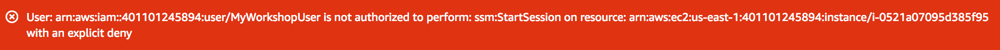

# Module 2: Session Manager

In this module we'll focus on the configuration of setting up secure administrative access to both on-premise systems and EC2 instances. The most secure environment is one in which no access is provided and all configuration has been done as part of a standard build process. However in the development environment you may still need access to your systems for iterating on configuration and troubleshooting. Using Amazon Systems Manager Session Manager and AWS IAM with tag based permissions we will implement this exact scenario and review the audit logs.

Using our Cloud9IDE and VPC, created by the CloudFormation Stack, we will create IAM roles with permissions to enable Session Manager access. Additionally, we are going to deploy 4 EC2 Instances, 4 will be standard AWS EC2 Instances (one tagged as development and the other production), and 2 instances will be used as mock on-premise systems. We will setup Systems Manager to manage the on-premise systems as well as the EC2 instances. Additionally, we will setup logging and review our activities after we've validated appropriate access.

## Agenda

1. Create IAM roles and permissions to enable Session Manager
2. Create instances and install the SSM Agent
3. Configure Systems Manager and enable Hybrid management
4. Create IAM users and policy restrictions based on tags
5. Configure logging
6. Confirm appropriate access and review logs

## Create IAM roles and permissions to enable Session Manager for Amazon EC2 Instances

1.Go to **Outputs** section from your CloudFormation deployment, and click on the **Cloud9IDE**. Setup your AWS config file and ensure your Cloud9 environment is using your Access Keys, for additional details follow <a href="https://docs.aws.amazon.com/cli/latest/userguide/cli-chap-configure.html" target="_blank">Quickly Configuring the AWS CLI</a> You may need to disable AWS managed temporary credentials in Cloud9 Preference, AWS Settings, Credentials.

2.In Cloud9, create an instance profile:

```bash
aws iam create-instance-profile --instance-profile-name SSMLabProfile
```

3.Create the json trust policy doc to attach to the IAM role. Create a new file with the following contents, save the file name: **lab-role-trust-policy.json**:
```json
    {
      "Version": "2012-10-17",
      "Statement": {
        "Effect": "Allow",
        "Principal": {"Service": "ec2.amazonaws.com"},
        "Action": "sts:AssumeRole"
      }
    }
```

4.Create an IAM role using the trust policy above:
```bash
aws iam create-role --role-name SSMLabRole --assume-role-policy-document file://lab-role-trust-policy.json
```

5.Add the role to the instance profile:
```bash
aws iam add-role-to-instance-profile --role-name SSMLabRole --instance-profile-name SSMLabProfile
```

6.Attach the existing **EC2RoleSSMAccess** to the newly created instance-profile:
```bash
aws iam attach-role-policy --policy-arn arn:aws:iam::aws:policy/service-role/AmazonEC2RoleforSSM --role-name SSMLabRole
```

## Create IAM roles and permissions to enable Session Manager for hybrid systems

1.Create a text file with a name such as ssmservice-trust-policy.json with the following trust policy. Make sure to save the file with the .json file extension.
```json
{
  "Version": "2012-10-17",
  "Statement": {
    "Effect": "Allow",
    "Principal": {"Service": "ssm.amazonaws.com"},
    "Action": "sts:AssumeRole"
  }
}
```

2.Create a new role named **SSMServiceRole**:
```bash
aws iam create-role --role-name SSMServiceRole --assume-role-policy-document file://ssmservice-trust-policy.json
```

3.Attach-role-policy enables the SSMServiceRole to create a session token. The session token gives your managed instance permissions to run commands using System Manager.
```bash
aws iam attach-role-policy --role-name SSMServiceRole --policy-arn arn:aws:iam::aws:policy/AmazonSSMManagedInstanceCore
```

4.Let's make sure we allow our on-premise systems to write to CloudWatchLogs so that we can use the same Audit and Logging tools to review administrative access. We'll use the same Attach-role-policy to attach a policy that enables the SSMServiceRole to write to CloudWatchLogs.
```bash
aws iam attach-role-policy --role-name SSMServiceRole --policy-arn arn:aws:iam::aws:policy/CloudWatchAgentServerPolicy
```

## Configure Systems Manager to enable hybrid management

The activation process provides an Activation Code and ID which functions like an access key and secret key to provide secure access to the Systems Manager service form your managed instances.

1.Open the command line, Create a managed-instance activation for your Dev instance
> Please specify the us-east-1 region
``` bash
aws ssm create-activation --default-instance-name DevOnPrem --iam-role SSMServiceRole --registration-limit 10 --region us-east-1
```

2.Create a managed-instance activation for your Prod instance
> Please specify the us-east-1 region
``` bash
aws ssm create-activation --default-instance-name ProdOnPrem --iam-role SSMServiceRole --registration-limit 10 --region us-east-1
```

**Store the managed-instance Activation Code and Activation ID in a safe place.** You specify this Code and ID when you install SSM Agent on systems on-premise. The code and ID combination functions like an Amazon EC2 access key ID and secret key to provide secure access to the Systems Manager service from your managed instances.

>If you lose the Code and ID, you must create a new activation. An activation expiration is a window of time when you can register on-premises machines with Systems Manager, default is 24 hours. An expired activation has no impact on your servers or virtual machines (VMs) that you registered with Systems Manager. This means that if an activation expires then you can’t register more servers or VMs with Systems Manager by using that specific activation. You simply need to create a new one. All of the servers and VMs that you registered will continue to be registered Systems Manager managed instances until you remove or disable SSM Agent on the server or VM and thereby unregister it. <a href="https://docs.aws.amazon.com/cli/latest/reference/ssm/create-activation.html" target="_blank">For more details:</a>


## Create instances and install the SSM Agent

1.Go back to the CloudFormation Stack, find the stack that starts with "aws-cloud9-*" click on **Resources** and take note of the Security Group ID (sg-abc123). Now find the stack named "InfrastructureIdentity-Env-Setup" click on **Resources** and find the PublicSubnet1 and take note of that as you will use it in steps 2-5.

2.Now we will build the production instance using the Security Group ID and PublicSubnet1 created for us earlier, using the following cli command:
```bash
aws ec2 run-instances --iam-instance-profile Name=SSMLabProfile --image-id ami-0080e4c5bc078760e --instance-type t1.micro --subnet-id "subnet-xx" --security-group-ids "sg-xx" --associate-public-ip-address --tag-specifications 'ResourceType=instance,Tags=[{Key="Name",Value="ProdEC2Instance"},{Key="Environment",Value="Prod"}]'
```

3.Build the development instance using the following cli command:
Note: If you pick a different region, please correct the ami-id (see table below).  
```bash
aws ec2 run-instances --iam-instance-profile Name=SSMLabProfile --image-id ami-0080e4c5bc078760e --instance-type t1.micro --subnet-id "subnet-xx" --security-group-ids "sg-xx" --associate-public-ip-address --tag-specifications 'ResourceType=instance,Tags=[{Key="Name",Value="DevEC2Instance"},{Key="Environment",Value="Dev"}]'
```

4.Build a MOCK production on-premises instance using the following cli command:
>**IMPORTANT:** We are not assigning an Instance Profile as these instances will mock our hybrid servers. **Please use your own key-pair**.

```bash
aws ec2 run-instances --image-id ami-0080e4c5bc078760e --instance-type t1.micro --subnet-id "subnet-xx" --security-group-ids "sg-xx" --associate-public-ip-address --key-name "keyname-xx" --tag-specifications 'ResourceType=instance,Tags=[{Key="Name",Value="ProdOnPrem"},{Key="Environment",Value="Prod"}]'
```

5.Build the MOCK on-premises development instance using the following cli command:
>**IMPORTANT:** We are not assigning an Instance Profile as these instances will mock our hybrid servers. **Please use your own key-pair**.
```bash
aws ec2 run-instances --image-id ami-0080e4c5bc078760e --instance-type t1.micro --subnet-id "subnet-xx" --security-group-ids "sg-xx" --associate-public-ip-address --key-name "keyname-xx" --tag-specifications 'ResourceType=instance,Tags=[{Key="Name",Value="DevOnPrem"},{Key="Environment",Value="Dev"}]'
```

6.Update the Cloud9 security group to allow inbound SSH from **172.20.0.0/16**.

7.From your Cloud9 instance login to **DevOnPrem** and Run the following commands to install SSM with the correct Activation code and ID.
```bash
mkdir /tmp/ssm
curl https://s3.amazonaws.com/ec2-downloads-windows/SSMAgent/latest/linux_amd64/amazon-ssm-agent.rpm -o /tmp/ssm/amazon-ssm-agent.rpm
sudo yum install -y /tmp/ssm/amazon-ssm-agent.rpm
sudo stop amazon-ssm-agent
sudo amazon-ssm-agent -register -code "activation-code" -id "activation-id" -region "region"
sudo start amazon-ssm-agent
```

8.From your Cloud9 instance login to **ProdOnPrem** and Run the following commands to install SSM with the correct Activation code and ID.
```bash
mkdir /tmp/ssm
curl https://s3.amazonaws.com/ec2-downloads-windows/SSMAgent/latest/linux_amd64/amazon-ssm-agent.rpm -o /tmp/ssm/amazon-ssm-agent.rpm
sudo yum install -y /tmp/ssm/amazon-ssm-agent.rpm
sudo stop amazon-ssm-agent
sudo amazon-ssm-agent -register -code "activation-code" -id "activation-id" -region "region"
sudo start amazon-ssm-agent
```
**DON’T Forget to start the ssm agent after activation - sudo start amazon-ssm-agent**

9.Log out of DevOnPrem and ProdOnPrem systems.

## Configure Systems Manager and enable Hybrid management

In order to use Session Manager to connect to hybrid systems SSM needs to be configured for advanced-instances tier. To enable the advanced-instances tier:

1.Open the **AWS Systems Manager** console

2.In the navigation pane, choose **Managed instances**.

3.Choose the **Settings** tab.

4.Choose **Change account setting**.

5.Review the information in the pop-up about changing account settings, and then, if you approve, choose the option to accept and click **Change setting**. **NOTE:** The system can take several minutes to complete the process of moving all instances from the standard-instances tier to the advanced-instances tier.

6.Select **Managed Instances** You should now see a new **Advanced Instances** label next to the Managed Instances Heading and you can now manage hybrid systems.

### Create IAM users and policy restrictions based on tags
**NOTE:** The following steps require full access to IAM.

1.From your Cloud9 session, use the create-user command to create the user.
```bash
aws iam create-user --user-name MyWorkshopUser
```

2.Assign a password to the user
```bash
aws iam create-login-profile --user-name MyWorkshopUser --password 'My!User1Login8P@ssword'
```

3.Now we will create and attach an IAM Custom Policy to MyWorkshopUser. Create a Custom IAM Policy named SSMDevAccess, **Copy** the json code below and paste it into a new file called **SSMDevAccess.json**
>This file must reside in the same directory where your CLI session is running, or you must specify the location.
```bash
{
    "Version": "2012-10-17",
    "Statement": [
        {
            "Effect": "Allow",
            "Action": [
                "ssm:DescribeSessions",
                "ssm:GetConnectionStatus",
                "ssm:DescribeInstanceProperties",
                "ec2:DescribeInstances",
                "ssm:StartSession"
            ],
            "Resource": "*"
        },
        {
            "Sid": "ReadAlltheSSMThings",
            "Effect": "Allow",
            "Action": [
                "ssm:Get*",
                "ssm:Describe*",
                "ssm:List*"
            ],
            "Resource": "*"
        },
        {
            "Sid": "SameUserTerminate",
            "Effect": "Allow",
            "Action": "ssm:TerminateSession",
            "Resource": "arn:aws:ssm:*:*:session/${aws:username}-*"
        },
        {
            "Sid": "DenySMtoProd",
            "Effect": "Deny",
            "Action": "ssm:StartSession",
            "Resource": [
                "arn:aws:ec2:*:*:instance/*"
            ],
            "Condition": {
                "StringLike": {
                    "ssm:resourceTag/Environment": "Prod"
                }
            }
        }
    ]
}
```

4.Create the IAM policy using the file you just created
```bash
aws iam create-policy --policy-name SSMDevAccess --policy-document file://SSMDevAccess.json
```

The result should return the following:
````
 {
    "Policy": {
        "PolicyName": "SSMDevAccess",
        "PolicyId": "ANPAJIFY55FF57L6ZEHKO",
        "Arn": "arn:aws:iam::123456789012:policy/SSMDevAccess",
        "Path": "/",
        "DefaultVersionId": "v1",
        "AttachmentCount": 0,
        "PermissionsBoundaryUsageCount": 0,
        "IsAttachable": true,
        "CreateDate": "2019-03-21T20:51:21Z",
        "UpdateDate": "2019-03-21T20:51:21Z"
    }
}
````

5.Copy the Arn value as you will need it for the next instruction. Copy the portion to the right of the "Arn": `arn:aws:iam::123456789012:policy/SSMDevAccess`.

6.To attach the policy, use the attach-user-policy command, and reference the environment variable that holds the policy ARN.
```bash
aws iam attach-user-policy --user-name MyWorkshopUser --policy-arn arn:aws:iam::123456789012:policy/SSMDevAccess
```

7.Let's attach a policy that allows our workshop user to view the logs in CloudWatch.
```bash
aws iam attach-user-policy --user-name MyWorkshopUser --policy-arn  arn:aws:iam::aws:policy/CloudWatchLogsReadOnlyAccess
```
8.Let's attach a policy that allows our workshop user to view the events in CloudTrail.
```bash
aws iam attach-user-policy --user-name MyWorkshopUser --policy-arn arn:aws:iam::aws:policy/CloudWatchEventsReadOnlyAccess
```

9.Verify that the policy is attached to the user by running the list-attached-user-policies command.
```bash
aws iam list-attached-user-policies --user-name MyWorkshopUser
```
The result should return the following:
```
{
    "AttachedPolicies": [
        {
            "PolicyName": "SSMDevAccess",
            "PolicyArn": "arn:aws:iam::aws:policy/SSMDevAccess"
        }
    ]
}


```


## Configure Logging

Session Manager provides you with options for auditing and logging session activity in your AWS account. This allows you to do the following:
>
> *	Create and store session logs for archival purposes.
> *	Generate a report showing details of every connection made to your instances using Session Manager over the past 30 days.
> * Generate notifications of session activity in your AWS account, such as Amazon Simple Notification Service (Amazon SNS) notifications.
> *	Automatically initiate another action on an AWS resource as the result of session activity, such as running an AWS Lambda function, starting an AWS CodePipeline pipeline, or running an AWS Systems Manager Run Command document.

We will log session data using Amazon CloudWatch Logs, archive session logs to Amazon S3 and generate access reports.

1. To setup Session Manager logging in Amazon CloudWatch Logs, open the <a href="https://console.aws.amazon.com/cloudwatch/" target="_blank">CloudWatch Console</a>. In the navigation pane, choose **Logs**

2. Choose Actions, Create log group.

3. Type in the following name for the log group "SSM-Logs"

4. Now open the <a href="https://console.aws.amazon.com/systems-manager/" target="_blank">AWS Systems Manager console</a>. In the navigation pane, choose **Session Manager**

2.	Select **Configure Preferences** You have several additional configurations options that we will not use for this lab but should consider for future use:
>
> * Log all of your session session output to Amazon S3 and Encrypt the log data.
> * Encrypt your active session data between your users' local machine and the managed instance using KMS.
> * Enable RunAs support for Linux instances instead of the ssm-user account.


3.	Select the check box next to **CloudWatch logs**.

4.	For CloudWatch logs, select **Choose a log group name from the list** specify the CloudWatch Logs group you just created **SSM-Logs** and select **Save**. Additionally, you can view ssm-agent logs on the instance here:
>
> * /var/log/amazon/ssm/amazon-ssm-agent.log
> * /var/log/amazon/ssm/errors.log


## Confirm Access

1.Sign out of your current session or login into to your AWS account using a different browser as **MyWorkshopUser**. Go to the <a href="https://console.aws.amazon.com/systems-manager/" target="_blank">AWS Systems Manager console</a>. In the navigation pane, choose **Session Manager**

2.Click **Start session**, select the **ProdOnPrem** name, click on **start Session** and a new session windows should open for you. This demonstrates that you can manage on-premise systems with Session Manager.

3.In the Session Manager session type the following:
```bash
whoami
```
The result should return the following:
ssm-user

3.Click Terminate to end.

4.Repeat the steps above with the DevSSM instance. You should find the same results, the result should return the following:
ssm-user

5.Click **Terminate** to end.

6.Now try the ProdSSM instance, click start Session. The result should return the following:


7.Click **Terminate** to end your session, at this point, all sessions should be terminated.

8.Go to the **AWS Systems Manager**, click on **Session Manager**, click on **Session History**. Your sessions should show up as Terminated or Terminating. Once the session has terminated you will see a link to **CloudWatch Logs**.


Click on it to view the audit logs of your session. CloudWatch Logs will show details of the session such as commands that were run on the host. These logs can also be stored in S3 for you.


9.If you have CloudTrail enabled, you can view the Session Manager events in CloudTrail as well. Go to **CloudTrail** and find the Event name **StartSession** to view the details of your Session Manager session that CloudTrail captures. You Should see something like this:


## Troubleshooting

•	If your on-premises instances are showing offline, make sure the ssm-agent was re-started after the SSM activation process.
