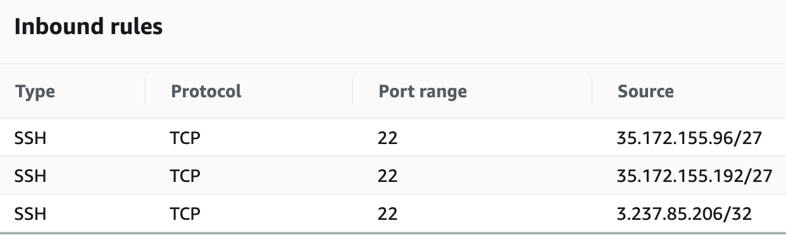

# Module 3: Using Amazon EC2 Instance Connect

In the last module you used AWS Systems Manager Session Manager to securely access and administer your on-premises systems and Amazon EC2 Instances. Recently we announced a new feature that can be used for secure administration of EC2 Instances called Amazon EC2 Instance Connect. Amazon EC2 Instance Connect provides a simple and secure way to connect to your instances using Secure Shell (SSH). With EC2 Instance Connect, you use AWS Identity and Access Management (IAM) policies and principals to control SSH access to your instances, removing the need to share and manage SSH keys.

When you connect to an instance using EC2 Instance Connect, the Instance Connect API pushes a one-time-use SSH public key to the instance metadata where it remains for 60 seconds. The IAM policy attached to your IAM user authorizes your IAM user to push the public key to the instance metadata. The AuthorizedKeysCommand and AuthorizedKeysCommandUser, configured when Instance Connect is installed, tells the SSH daemon to look up the public key from the instance metadata for authentication, and connects you to the instance.

You can use Instance Connect to connect to your instances using any SSH client of your choice or the Instance Connect CLI, or you can connect to your instances by using the new browser-based SSH client in the Amazon EC2 console.

<a href="https://docs.aws.amazon.com/AWSEC2/latest/UserGuide/ec2-instance-connect-set-up.html" target="_blank">Click here for more information and a list of currently supported Operating Systems</a>

## Tasks

1. Build an EC2 Instance and install the EC2 Instance Connect client
2. Create IAM permissions to enable EC2 Instance Connect
3. Confirm Access

### Task 1: Build an EC2 Instance and install the EC2 Instance Connect client
EC2 Instance Connect is already installed on all versions of Amazon Linux 2, however we will use Ubuntu Server and install the client so we can become familiar with the process.

1.Using the same Cloud9IDE tab. Make sure your credentials are still in place on the Cloud9IDE, for additional details follow quickly configuring the AWS CLI You may need to disable AWS managed temporary credentials in Cloud9 Preference, AWS Settings, Credentials.

2.Create a text file named **connect-install.txt**, using the following contents:
```json
#!/bin/bash
apt-get update
apt-get install ec2-instance-connect
less /lib/systemd/system/ssh.service.d/ec2-instance-connect.conf
```

3.We will use the same SUBNET, SECGROUP and MYKEYPAIR values from Module 2 to create an Ubuntu Ec2 Instance. Create a file called **CreateUbuntuSystem.sh**. Copy the items from your scratch pad and replace them in the file you just created.
```bash
#!/bin/bash

## update with your subnet
SUBNET="subnet-xxxx"
## update with your security group
SECGROUP="sg-xxxx"
## update with your own key
MYKEYPAIR="MyKeyPairxxxx"
##update with your region
REGION="us-east-1"

#---no need to modify below----
## Create the Ubuntu Instance
aws ec2 run-instances --iam-instance-profile Name=SSMLabProfile --image-id ami-026c8acd92718196b --instance-type t1.micro --subnet-id "${SUBNET}" --security-group-ids "${SECGROUP}" --associate-public-ip-address --tag-specifications 'ResourceType=instance,Tags={Key="Name",Value="EC2ConnectInstance"}' --region "${REGION}" --user-data file://connect-install.txt
```
4.In order to connect using the browser based EC2 Instance Connect client we need to allow inbound SSH access. You can either using the public ip of your laptop or for the purposes of the lab we can use 0.0.0.0/Update the inbound rules of the Cloud9 Security Group to now allow SSH from the the Internet 0.0.0.0/. From the <a href="https://console.aws.amazon.com/ec2/v2/home?region=us-east-1#Home:" target="_blank">EC2 Console</a> scroll down to **NETWORK & SECURITY**, click on **Security Groups**, click the box next to the Security Group that starts with **"aws-cloud9-mod-"**, go to the **inbound tab** and click edit. Click **Add Rule**, Under Type select **SSH**, for the Source use **0.0.0.0/0** and add "EC2 Instance Connect Browser Client" in the description.

The updated inbound rules for the Security Group should look like this:



4.Change the permissions on your script so that only you as the owner can execute it.
```bash
chmod 0755 CreateUbuntuSystem.sh
```
5.Execute the script.
```bash
./CreateUbuntuSystem.sh
```
6.Let's confirm that we have a new system running. Go to <a href="https://console.aws.amazon.com/ec2/v2/home?region=us-east-1#Home:" target="_blank">EC2 Console</a>
Click on **Running Systems** you will see a list of systems. Click on the EC2ConnectInstance. Again notice that we do not have Key pair name associated as we built it without a key pair and will be using EC2 Instance Connect for access.

 * EC2ConnectInstance


7.From the previous output note the instance-id in your scratchpad, we will use it in the next section.
```json
    "InstanceId": "i-000abcdefghijklmn",
```

### Task 2: Create IAM permissions to enable EC2 Instance Connect

1.We will create and attach an IAM Customer Managed Policy to MyWorkshopUser. Create a new file with the following contents but **Replace** the "i-xx" with the instance-id that you noted earlier, save the file name: **InstanceConnect.json**

>Update the **Account ID** and instance id (**i-xx**)from your scratchpad

```json
{
	"Version": "2012-10-17",
	"Statement": [{
		"Effect": "Allow",
		"Action": "ec2-instance-connect:SendSSHPublicKey",
		"Resource": "arn:aws:ec2:us-east-1:123456789012:instance/i-xx",
		"Condition": {
			"StringEquals": {
				"ec2:osuser": "ubuntu"
			}
      }
		},
    {
        "Effect": "Allow",
        "Action": "ec2:Describe*",
        "Resource": "*"
    }
	]
}
```
>
> * The ec2-instance-connect:SendSSHPublicKey action grants an IAM user permission to push the public key to an instance.
> * The ec2:osuser condition specifies the default user name for the AMI that you used to launch your instance. For Amazon Linux 2, the default user name is ec2-user. For the Ubuntu AMI, the default user name is ubuntu.

2.Create the IAM policy using the file you just created
```bash
aws iam create-policy --policy-name InstanceConnect --policy-document file://InstanceConnect.json
```
The result should return the following:
```json
{
    "Policy": {
        "PolicyName": "InstanceConnect",
        "PermissionsBoundaryUsageCount": 0,
        "CreateDate": "2019-07-23T19:58:59Z",
        "AttachmentCount": 0,
        "IsAttachable": true,
        "PolicyId": "ANPAXMAS344KJ6Q7CGW4F",
        "DefaultVersionId": "v1",
        "Path": "/",
        "Arn": "arn:aws:iam::abc123:policy/InstanceConnect",
        "UpdateDate": "2019-07-23T19:58:59Z"
    }
}
```
3.This above command will output a policy ARN for the policy we just created. **Copy** the ARN value from the output and replace it in the next command.

4.To attach the policy, use the attach-user-policy command, and update the Account ID in the policy ARN below.
```bash
aws iam attach-user-policy --user-name MyWorkshopUser --policy-arn arn:aws:iam::abc123xxx:policy/InstanceConnect
```

### Task 3: Confirm Access

1.Go to the <a href="https://console.aws.amazon.com/iam/home?#/home" target="_blank">IAM console</a>, copy the IAM users sign-in link, it should look similar to this:
https://123456789012.signin.aws.amazon.com/console

2.Open a new browser and paste in the IAM users sign-in link. Sign into the AWS account as **MyWorkshopUser** with the password you created earlier. Go to the <a href="https://console.aws.amazon.com/systems-manager/" target="_blank">AWS Systems Manager console</a>. In the navigation pane, choose **Session Manager**

3.Make sure you are in the **us-east-1(N.Virginia)** region . Go to **EC2**, select **Instances**, select the **EC2ConnectInstance**. Select **Connect** and choose the option to **connect with EC2 Instance Connect (browser-based SSH connection)**. Update the user name to **ubuntu**. EC2 Instance Connect performs the following three actions in one call: it generates a one-time-use SSH public key, pushes the key to the instance where it remains for 60 seconds, and connects the user to the instance. You can use basic SSH/SFTP commands with the Instance Connect CLI.

3.You should see the EC2 Instance Connect (browser-based SSH connection) appear.


>
>* The command “w” displays the detailed information about the users who are logged in the system currently.
>* The simple “date” command displays the current date and time (including the day of the week, month, time, time zone, year).
Enter in the following commands:
```bash
w
date
```

The results should look similar to this:


4.Now that you've seen how Session Manager and EC2 Instance Connect work.
>
>* What do you think?
>* What are the Pros & Cons for using each?
>* What is your preference?
