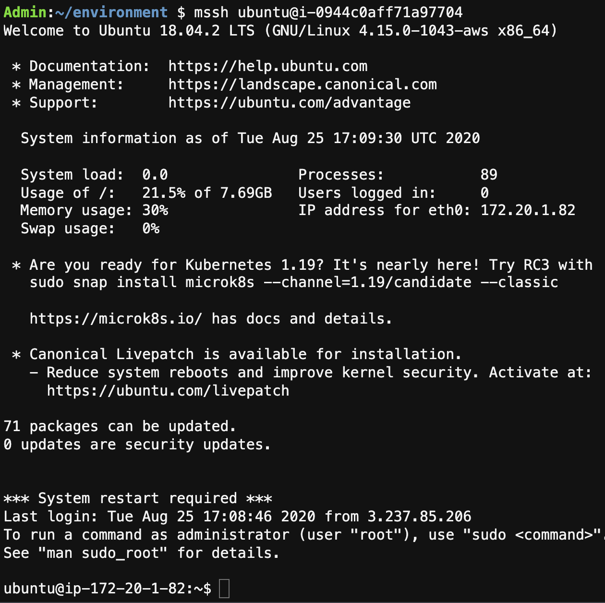
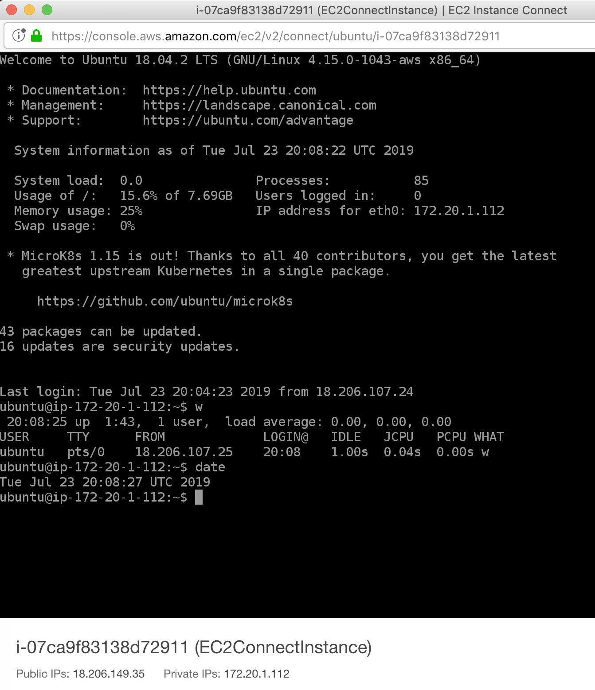

# Module 3: Using Amazon EC2 Instance Connect

In the last module you used AWS Systems Manager Session Manager to securely access and administer your on-premise systems and Amazon EC2 Instances. Recently we announced a new feature that can be used for secure administration of EC2 Instances called Amazon EC2 Instance Connect. Amazon EC2 Instance Connect provides a simple and secure way to connect to your instances using Secure Shell (SSH). With EC2 Instance Connect, you use AWS Identity and Access Management (IAM) policies and principals to control SSH access to your instances, removing the need to share and manage SSH keys.

When you connect to an instance using EC2 Instance Connect, the Instance Connect API pushes a one-time-use SSH public key to the instance metadata where it remains for 60 seconds. The IAM policy attached to your IAM user authorizes your IAM user to push the public key to the instance metadata. The AuthorizedKeysCommand and AuthorizedKeysCommandUser, configured when Instance Connect is installed, tells the SSH daemon to look up the public key from the instance metadata for authentication, and connects you to the instance.

You can use Instance Connect to connect to your instances using any SSH client of your choice or the Instance Connect CLI, or you can connect to your instances by using the new browser-based SSH client in the Amazon EC2 console.

<a href="https://docs.aws.amazon.com/AWSEC2/latest/UserGuide/ec2-instance-connect-set-up.html" target="_blank">More Information and a list of currently supported Operating Systems</a>

## Build an EC2 Instance and install the EC2 Instance Connect client.
EC2 Instance connect is already installed on all version of Amazon Linux 2, however we will use Ubuntu Server and install the client so we can become familiar with the process.

1.This lab will be executed from your Cloud9IDE. Go to Outputs tab from your **InfrastructureIdentity-Env-Setup** CloudFormation stack, and click on the value next to Cloud9IDE. Make sure your credentials are still in place on the Cloud9IDE, for additional details follow quickly configuring the AWS CLI You may need to disable AWS managed temporary credentials in Cloud9 Preference, AWS Settings, Credentials.

2.Go back to **CloudFormation**, find the stack that starts with **aws-cloud9-**, click on **Resources** and take note Security Group ID (sg-abc123) for **InstanceSecurityGroup**. Next, find the CloudFormation Stack named **InfrastructureIdentity-Env-Setup**, click on **Resources** and take note of the subnet-id (subnet-abc123) for **PublicSubnet1**, you will use these in steps 3-6.

3.Create a text file named connect-install.txt, using the following contents:
```json
#!/bin/bash
apt-get update
apt-get install ec2-instance-connect
less /lib/systemd/system/ssh.service.d/ec2-instance-connect.conf
```
4.The following command will build an Ubuntu instance with EC2-Instance-Connect installed using user-data, using the Security Group ID and Public Subnet created for us earlier, using the following cli command:
>Before you run the command below remove all quotes and replace "subnet-xx" and "sg-xx" with the information from the previous step and your SSH key.
```bash
aws ec2 run-instances --image-id ami-026c8acd92718196b --instance-type t1.micro --subnet-id subnet-xx --security-group-ids sg-xx --associate-public-ip-address --tag-specifications 'ResourceType=instance,Tags={Key="Name",Value="EC2ConnectInstance"}' --user-data file://connect-install.txt
```

5.You will see the output that includes details about the instance you just created. Take note of the instance-id as we will use it in the next section.
```json
    "InstanceId": "i-000abcdefghijklmn",
```

6.Update the Cloud9 security group named **aws-cloud9-InfrastructureIdentity-Env-Setup-Cloud9Instance-** to allow inbound SSH from **0.0.0.0/0**.


## IAM roles and permissions to enable EC2 Instance Connect

1.Now we will create and attach an IAM Custom Policy to MyWorkshopUser. Create a Custom IAM Policy named InstanceConnect.json. Update the "i-xx" with the instance-id that you noted earlier. Copy the json code below and paste it into a new file called InstanceConnect.json

>This file must reside in the same directory where your CLI session is running, or you must specify the location.

```json
{
	"Version": "2012-10-17",
	"Statement": [{
		"Effect": "Allow",
		"Action": "ec2-instance-connect:SendSSHPublicKey",
		"Resource": "arn:aws:ec2:region:account-id:instance/i-xx",
		"Condition": {
			"StringEquals": {
				"ec2:osuser": "ubuntu"
			}
		}
	}]
}
```
>
> * The ec2-instance-connect:SendSSHPublicKey action grants an IAM user permission to push the public key to an instance.
> * The ec2:osuser condition specifies the default user name for the AMI that you used to launch your instance. For Amazon Linux 2, the default user name is ec2-user. For the Ubuntu AMI, the default user name is ubuntu.

2.Create the IAM policy using the file you just created
```bash
aws iam create-policy --policy-name InstanceConnect --policy-document file://InstanceConnect.json
```
The result should return the following:
```json
{
    "Policy": {
        "PolicyName": "InstanceConnect",
        "PermissionsBoundaryUsageCount": 0,
        "CreateDate": "2019-07-23T19:58:59Z",
        "AttachmentCount": 0,
        "IsAttachable": true,
        "PolicyId": "ANPAXMAS344KJ6Q7CGW4F",
        "DefaultVersionId": "v1",
        "Path": "/",
        "Arn": "arn:aws:iam::abc123:policy/InstanceConnect",
        "UpdateDate": "2019-07-23T19:58:59Z"
    }
}
```

3.To attach the policy, use the attach-user-policy command, and reference the environment variable that holds the policy ARN.
```bash
aws iam attach-user-policy --user-name MyWorkshopUser --policy-arn arn:aws:iam::abc123:policy/InstanceConnect
```

## Confirm Access
1.You can connect to an instance as the MyWorkshopUser, login as that user with a different browser.

2.Go to **EC2**, select **Instances**, select the **EC2ConnectInstance**. Select **Connect** and choose the option to **connect with EC2 Instance Connect (browser-based SSH connection)**. Update the user name to **ubuntu**. EC2 Instance Connect performs the following three actions in one call: it generates a one-time-use SSH public key, pushes the key to the instance where it remains for 60 seconds, and connects the user to the instance. You can use basic SSH/SFTP commands with the Instance Connect CLI.

3.You should see the EC2 Instance Connect (browser-based SSH connection) appear.


>
>* The command “w” displays the detailed information about the users who are logged in the system currently.
>* The simple “date” command displays the current date and time (including the day of the week, month, time, time zone, year).
Enter in the following commands:
```bash
w
date
```

The results should look similar to this:



4.Now that you've seen how Session Manager and EC2 Instance Connect work.
>
>* What do you think?
>* What are the Pros & Cons for using each?
>* What is your preference?
