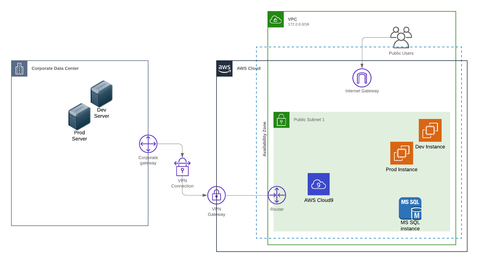

# Overview

This workshop is designed to help you get familiar with AWS Security services and learn how to use them to securely administer systems in your environment.  You'll be working with services such as AWS Systems Manager Session Manager, Amazon EC2 Instance Connect, and AWS Identity and Access Management. You will learn how to use these services to securely connect and administer your Amazon EC2 Instances as well as systems on-premise, you will setup tagged based access, and configure logging which will enable auditing of administrative activities and improve the security posture of your environment.

* **Level**: Intermediate
* **Duration**: 2 hours
* **<a href="https://www.nist.gov/cyberframework/online-learning/components-framework" target="_blank">CSF Functions</a>**: Protect and Detect
* **<a href="https://d0.awsstatic.com/whitepapers/AWS_CAF_Security_Perspective.pdf" target="_blank">CAF Components</a>**: Preventative, Detective
* **<a href="https://awssecworkshops.com/getting-started/" target="_blank">Prerequisites</a href>**: AWS Account, Admin IAM User

## Scenario

Your company is new to the cloud and has deployed their first set of development and productions systems in AWS, additionally you still have hosts to manage in your data center.  You are a systems administrator and have been tasked with setting up secure administrative access to your systems in AWS and on-premise.  As part of that configuration you are also responsible for confirm the ability to audit administrative activities.

## Architecture

For this Workshop you will have a 4 instances setup in the us-east-1 region, two instances will be your EC2 instances, the other two instances will be mock on-premise servers. Security has found that ssh keys are not properly secured and is asking for a better solution to secure administration of your on-premise systems and your EC2 Instances in AWS. Your security team has asked if there is way to centrally manage administrative access to systems and have full audit capabilities.

## Presentation deck
[Workshop Presentation Deck](./infrastructure-identity-workshop-presentation.pdf)

## Region
Please use the **us-east-1(N. Virginia)** region for this workshop.

## Modules

This workshop is broken up into the four modules below:

1. [Environment Build and Configuration](./01-environment-setup.md)
2. [Session Manager](./02-using-AWS-Systems-Manager-Session-Manager.md)
3. [EC2-Instance-Connect](./03-using-EC2-Instance-Connect.md)
4. [Clean-up](./04-cleanup.md)
